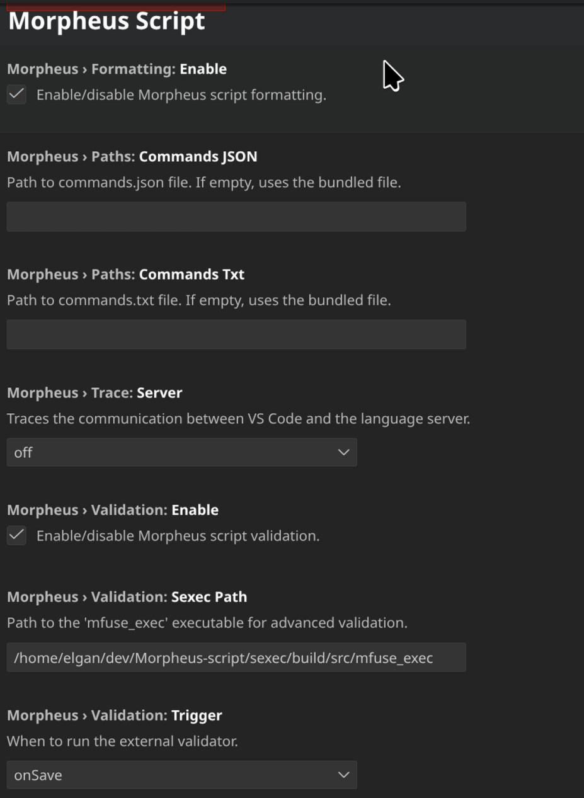

# Morpheus Script VSCode Extension

VSCode extension for the Morpheus scripting language used in Medal of Honor: Allied Assault (MOHAA).

## Features

- **Syntax Highlighting**: Complete support for `.scr` files including keywords, vectors, and dynamic entities.
- **Autocomplete**: Context-aware suggestions for standard commands and game-specific events.
- **Validation**: Basic syntax checking.
- **Hover Documentation**: View command documentation by hovering over commands.

## Screenshots

## Usage

1. Open a `.scr` file.
2. Enjoy syntax highlighting and autocomplete.